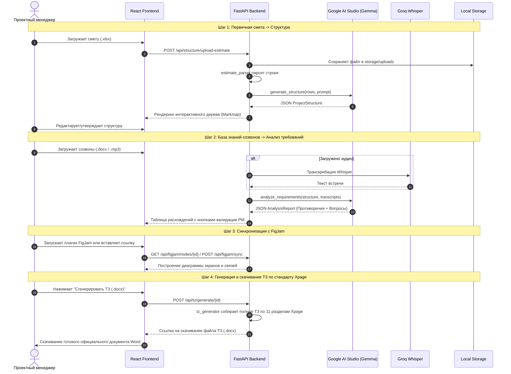

# 02. Архитектура системы и карта исходного кода

## 1. Структура директорий проекта

```
Сервис для разработки ППО/
├── .env                         # Локальные секреты и API-ключи (в .gitignore)
├── .env.example                 # Эталонный шаблон переменных окружения
├── .gitignore                   # Правила исключения временных файлов и секретов
├── WIKI/                        # Подробнейшая инженерная документация
│   ├── 01_OVERVIEW.md           # Обзор, бизнес-цели и метрики
│   ├── 02_ARCHITECTURE_AND_CODE_MAP.md  # Этот документ: архитектура и карта файлов
│   ├── 03_API_INTEGRATIONS.md   # Google AI Studio, Groq Whisper, Figma/FigJam
│   └── 04_DEVELOPMENT_GUIDE.md  # Инструкция разработчика: запуск, отладка, добавление фич
├── backend/                     # Серверная часть на FastAPI (Python)
│   ├── requirements.txt         # Зависимости Python
│   ├── run.py                   # Скрипт запуска сервера с автоперезагрузкой
│   ├── app/
│   │   ├── __init__.py
│   │   ├── main.py              # Точка входа FastAPI, middleware, роутеры
│   │   ├── config.py            # Pydantic Settings: парсинг и валидация .env
│   │   ├── models/              # Pydantic v2 модели данных и схем ответов AI
│   │   │   ├── __init__.py
│   │   │   ├── project.py       # Модель проекта, метаданные, этапы ППО
│   │   │   ├── structure.py     # Модель дерева экранов, модулей и элементов
│   │   │   ├── analysis.py      # Модель противоречий, пробелов и вопросов
│   │   │   └── tz.py            # Модель структуры технического задания
│   │   ├── services/            # Бизнес-логика и внешние интеграции
│   │   │   ├── __init__.py
│   │   │   ├── ai_service.py    # Клиент к Google AI Studio (Gemma 4 31B / Gemini)
│   │   │   ├── whisper_service.py # Клиент к Groq API (транскрибация аудио)
│   │   │   ├── figma_service.py # Клиент к Figma / FigJam REST API
│   │   │   ├── estimate_parser.py # Парсер Excel (.xlsx) смет
│   │   │   ├── transcript_parser.py # Парсер DOCX расшифровок созвонов
│   │   │   └── tz_generator.py  # Сборщик итогового Word (.docx) документа
│   │   ├── routers/             # Эндпоинты REST API
│   │   │   ├── __init__.py
│   │   │   ├── projects.py      # CRUD проектов ППО
│   │   │   ├── structure.py     # Загрузка сметы, генерация и апдейт структуры
│   │   │   ├── analysis.py      # Загрузка созвонов, анализ противоречий
│   │   │   ├── figjam.py        # Синхронизация с FigJam досками
│   │   │   └── tz.py            # Генерация и скачивание ТЗ в .docx
│   │   └── prompts/             # Системные промпты и шаблоны инструкций
│   │       ├── structure_prompts.py # Промпт декомпозиции сметы в дерево
│   │       ├── analysis_prompts.py  # Промпт кросс-валидации и поиска пробелов
│   │       └── tz_prompts.py        # Промпт генерации разделов ТЗ по Xpage
│   └── storage/                 # Локальное хранилище данных
│       ├── uploads/             # Загруженные файлы клиентов (сметы, созвоны)
│       ├── output/              # Сгенерированные документы Word и JSON-артефакты
│       └── projects.json        # База данных проектов в формате JSON
├── figjam-plugin/               # Нативный плагин для Figma / FigJam (авто-отрисовка холста)
│   ├── manifest.json            # Манифест плагина (devAllowedDomains, reasoning)
│   ├── ui.html                  # Окно управления плагином внутри FigJam
│   ├── code.js                  # Программный движок создания узлов, стикеров и коннекторов
│   └── README.md                # Инструкция по установке и запуску плагина в 1 клик
├── frontend/                    # Пользовательский интерфейс (React + Tailwind)
│   ├── index.html               # SPA точка входа с CDN React 18, Babel и Tailwind
│   └── app.jsx                  # Одностраничное приложение с визардом, холстом Mindmap и TZ
```

---

## 2. Карта ответственности модулей бэкенда

### `backend/app/config.py`
Загружает переменные из `.env` через `pydantic-settings`. 
Определяет:
* `google_api_key`: ключ Google AI Studio;
* `llm_model`: `gemma-4-31b-it` (с автоматическим фоллбеком на `gemini-2.5-flash`);
* `groq_api_key`: ключ Groq Cloud;
* `figma_access_token`: персональный токен Figma;
* Пути к папкам `storage/uploads` и `storage/output`.

### `backend/app/models/`
* **`structure.py`**: Описывает дерево проекта. `ProjectStructure` ⟶ список `Module` ⟶ список `Screen` ⟶ список `ScreenElement`. Содержит флаг `requires_clarification` и номер строки из сметы.
* **`analysis.py`**: `AnalysisReport` ⟶ список согласованных требований `RequirementItem`, список противоречий `Inconsistency` (с цитатами источников А и Б и готовым вопросом клиенту), список белых пятен `missing_critical_topics`.
* **`tz.py`**: Схема разделов ТЗ (Глоссарий, Цели, Архитектура, Описание экранов, Интеграции).

### `backend/app/services/`
* **`ai_service.py`**: Главная точка вызова нейросетей. Инкапсулирует вызовы Google AI Studio с передачей системного промпта и Pydantic-схемы для получения **гарантированно валидного JSON** (Structured Output).
* **`whisper_service.py`**: Отправляет аудиофайл (mp3, wav, m4a) в Groq Whisper API (`whisper-large-v3`) и возвращает текст с тайм-кодами.
* **`figma_service.py`**: Асинхронно стучится в Figma API по ключу файла, отфильтровывает лишнюю графику и возвращает структуру экранов и связей FigJam.
* **`estimate_parser.py`**: Извлекает из Excel-сметы названия экранов, комментарии, трудозатраты и группирует их по этапам.
* **`transcript_parser.py`**: Извлекает текст из DOCX созвонов, разделяя реплики спикеров и тайм-коды.
* **`tz_generator.py`**: Высокотехнологичный визуальный генератор официального Технического задания в формате Word (`.docx`) в строгом соответствии с корпоративным стандартом **`Шаблон Технического задания (ТЗ) Xpage.md`**. Генерирует документ на 35–50 страниц, включающий все 11 обязательных разделов, таблицы RBAC/CRUD, спецификацию REST API 1С, сценарии Use Cases, SLA и регламент UAT.

---

## 3. Жизненный цикл данных в системе (Data Flow)



---

## 4. Корпоративный стандарт Технического задания (11 разделов)

Генератор `tz_generator.py` компилирует официальный документ Microsoft Word (.docx) строго по шаблону `Шаблон Технического задания (ТЗ) Xpage.md` (643 строки, 11 разделов, 18 нормативных таблиц):
1. **Титульный лист и лист согласования**: фирменный колонтитул, номер документа `ТЗ-[ГОД]-[ПРОЕКТ]-01`, статус «Утверждено к разработке», таблица согласующих лиц (PM, CTO, PO, IT-директор) и версий (Changelog 0.1, 0.5, 0.9, 1.0).
2. **Раздел 1. Используемые термины и определения**: нормативный глоссарий из 11+ отраслевых и технических терминов (API, BFF, CMS, NavBar, Header, WebView, Push-уведомления, DeepLink, Сквозной элемент, Универсальный блок, Empty State).
3. **Раздел 2. Назначение, цели и задачи проекта**: измеримые бизнес-цели и KPI, границы проекта (Scope In / Scope Out), стек технологий.
   * **Раздел 2.5 (Динамическая вставка из Шага 2)**: результаты анализа созвонов с Заказчиком, индекс готовности требований (DoR), таблица согласованных требований (`REQ-01`...) и реестр урегулированных разногласий.
4. **Раздел 3. Пользовательские роли и матрица прав доступа (RBAC/CRUD)**: матрица ролей (Гость, Клиент, Верифицированный клиент, Оператор), права на сущности, сессионная безопасность (JWT OAuth 2.0, биометрия, автоблокировка).
5. **Раздел 4. Системная архитектура и интеграционные взаимодействия**: топология контура (Frontend -> BFF Gateway -> 1C / SMS / Эквайринг), требования к API и шине данных, реестр интеграций и протокол обработки сбоев очередей (Dead Letter Queue, повторные попытки).
6. **Раздел 5. Структура интерфейсов и карта экранов**:
   * **Прямая ссылка на интерактивный прототип FigJam (Шаг 3)**.
   * Сквозные элементы UI (NavBar, Header, шторки BottomSheet), дизайн-система и типовые состояния экранов.
7. **Раздел 6. Функциональные требования к модулям и экранам**: детальное описание экранов авторизации, главного экрана, каталогов, договоров, онлайн-оплаты, профиля, бонусной программы. Динамически дополняется экранами из структуры проекта.
8. **Раздел 7. Сквозные бизнес-сценарии (Use Cases)**: формализованные сценарии использования (предусловия, основной поток, альтернативные потоки, постусловия).
9. **Раздел 8. Нефункциональные требования (NFR)**: SLA и производительность (кэш <250мс, запросы 1С <1.5с, 100 RPS), отказоустойчивость Uptime 99.7%, соответствие ФЗ-152 о персональных данных, шифрование AES-256 / TLS 1.3, требования к дистрибутивам iOS и Android.
10. **Раздел 9. Требования к административной панели (CMS)**: управление баннерами, сторис, FAQ, контактами, аудит действий персонала.
11. **Раздел 10. Требования к тестированию и критерии приемки**: этапы QA, критерии готовности (DoD), программа и методика приемо-сдаточных испытаний (ПСИ).
12. **Раздел 11. План-график реализации и этапы проекта**: фазы проектирования, разработки, интеграции, пилотного запуска и гарантийные обязательства (60 дней).

### Детали верстки DOCX в `tz_generator.py`:
* **Оформление таблиц**: верхняя строка `#1E293B` с белым полужирным текстом, чередующиеся строки `#F8FAFC`, внутренние отступы ячеек (padding), предотвращение разрыва строк между страницами (`w:cantSplit`) и повторение шапки на новых страницах (`w:tblHeader`).
* **Каллауты и цитаты**: плашки со светлым фоном `#F0F7FF` и акцентной левой синей полосой `#3B82F6`.
* **Кодовые блоки**: моноширинный шрифт Consolas `#334155` на серой подложке `#F8FAFC`.
* **Колонтитулы**: верхний колонтитул с названием проекта и компании Xpage, нижний колонтитул конфиденциальности и номера страниц.

---

## 5. Движок визуальной архитектуры FigJam (`figjam_layout.py`)

Для построения архитектуры на холсте FigJam используется модуль `backend/app/services/figjam_layout.py`:
1. **Вертикальные стеки экранов (Wireframe Card Stacks)**:
   * Верхний навигационный блок с фиолетовой плашкой «Навигация» (`#7C3AED`) и белыми кнопками вкладок («Главная», «Оценки», «Адреса», «Оплата», «Чат»).
   * Авторизованный и неавторизованный главные экраны с фиолетовыми заголовками и белыми карточками виджетов с рамками `#CBD5E1`.
   * Левая ветвь: блоки уведомлений, пушей, поиска, каталога услуг.
   * Правая ветвь: функционал онлайн-оценки (AI-оценка по фото, ювелирные изделия, техника).
   * Нижний контур: залоговые билеты, профиль, программа лояльности, адреса отделений.
2. **Динамический генератор вертикальных колонок (`generate_dynamic_vertical_architecture`)**:
   * Для любых произвольных проектов автоматически рассчитывает вертикальные колонки экранов с заголовками модулей и карточками UI-элементов.
3. **Плагин Figma (`figjam-plugin/code.js`)**:
   * Загружает шрифты Inter (Regular, Medium, Bold).
   * Создает карточки через `figma.createShapeWithText()` с типом `ROUNDED_RECTANGLE`, выравниванием по левому краю для блоков и по центру для заголовков.
   * Создает связи через `figma.createConnector()` с типом `ELBOWED`, магнитами `start_magnet` / `end_magnet` и цветом `#3B82F6`.

