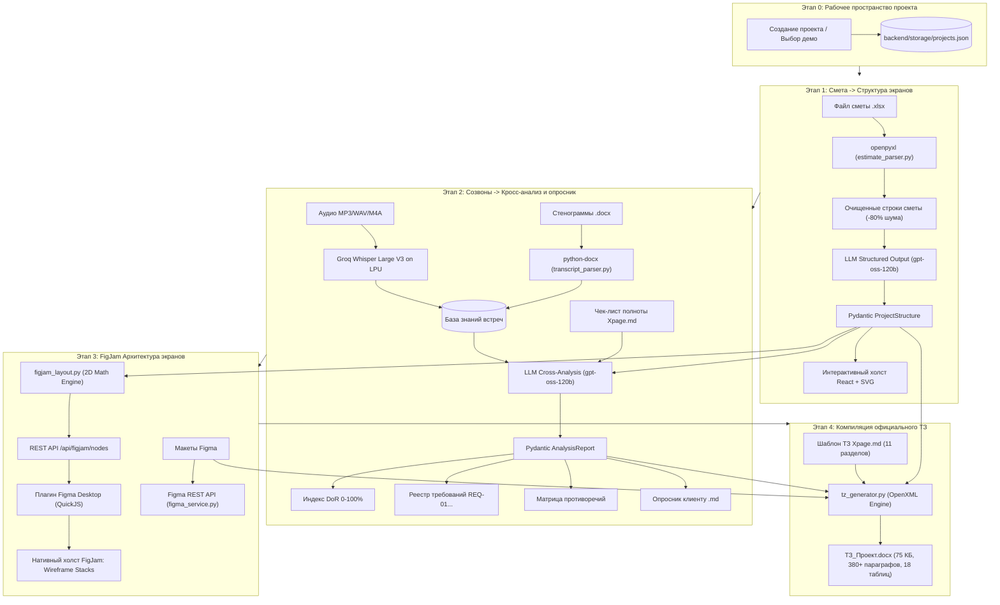

# 06. Полный пайплайн проекта и стек инструментов по этапам

В данном документе детально разобран сквозной конвейер (pipeline) сервиса автоматизации предпроектного обследования (ППО) IT-компании Xpage: назначение каждого этапа, входные и выходные артефакты, используемые библиотеки, алгоритмы и инструменты.

---

## 1. Архитектурная диаграмма сквозного пайплайна

---

## 2. Детальный разбор каждого этапа и используемых инструментов

### Этап 0: Инициализация и мультипроектное хранилище (Project Workspace)
* **Бизнес-назначение**: Изоляция контекста заказчиков, управление метаданными проекта и быстрый запуск эталонного демо-кейса («Приложение ломбарда»).
* **Входные данные**: Название проекта или нажатие кнопки «Демо-кейс Xpage».
* **Выходные данные**: Инициализированный объект проекта с уникальным UUID.
* **Используемые инструменты и технологии**:
  * **FastAPI**: асинхронный REST API сервер (`backend/app/routers/projects.py`).
  * **Pydantic v2 (`ProjectMetadata`)**: типизация метаданных, валидация полей и текущего шага (`current_step`).
  * **Локальное файловое хранилище (`backend/storage/`)**:
    - `projects.json`: легковесная база данных состояний проектов;
    - `uploads/{project_id}/`: хранилище загруженных смет и аудиозаписей;
    - `output/{project_id}/`: директория сгенерированных ТЗ и отчетов.

---

### Этап 1: Первичная смета -> Иерархия экранов и майндмэп
* **Бизнес-назначение**: Сократить ручной разбор Excel-сметы с 1 часа до 15 секунд, выделив перечень функциональных модулей, экранов и ключевых элементов интерфейса.
* **Входные данные**: Файл первичной сметы `.xlsx`.
* **Выходные данные**: Древовидная структура продукта `ProjectStructure` (модули, экраны со статусами и UI-элементами).
* **Используемые инструменты и технологии**:
  * **`openpyxl` (`estimate_parser.py`)**:
    - Открывает книгу Excel в режиме `data_only=True` (чтение вычисленных значений, а не сырых формул).
    - Извлекает разделы, строки задач, часы разработки.
    - Очищает данные от пустых строк, стилей верстки и формул, сокращая объем передаваемых токенов на **80%**.
  * **LLM-генератор (`ai_service.py`)**:
    - Модели: `openai/gpt-oss-120b` (основная) / `openai/gpt-oss-20b` / `qwen/qwen3.8-27b` через Groq Cloud API.
    - Промпт: `STRUCTURE_SYSTEM_PROMPT` (`backend/app/prompts/structure_prompts.py`).
    - Режим: `response_format={"type": "json_object"}`.
  * **Схема валидации Pydantic (`ProjectStructure`)**:
    - Проверяет структуру: `modules` -> `screens` -> `elements`.
    - Подсвечивает экраны флагом `requires_clarification=True`, если в смете формулировка размыта.
  * **Frontend (`frontend/app.jsx`)**:
    - React 18 + Tailwind CSS.
    - Два режима отображения: `Интерактивный холст` (SVG/Canvas дерево с масштабированием колесиком мыши) и `Карточки модулей`.
    - Возможность ручного добавления экранов через API `PUT /api/structure/update/{id}`.

---

### Этап 2: База знаний созвонов -> Анализ противоречий, DoR и опросник
* **Бизнес-назначение**: Устранить хаос в требованиях, выявить противоречия между встречами (Scope Creep, расхождения в интеграциях) и составить для Заказчика готовый опросник.
* **Входные данные**: Аудиозаписи встреч (`.mp3`, `.wav`, `.m4a`) или файлы расшифровок (`.docx`).
* **Выходные данные**: Отчет `AnalysisReport`: индекс готовности DoR, реестр согласованных требований `REQ-01`..., карточки противоречий и опросник клиенту.
* **Используемые инструменты и технологии**:
  * **`python-docx` (`transcript_parser.py`)**:
    - Парсинг абзацев, тайм-кодов и реплик участников встречи из файлов Microsoft Word.
  * **`Groq Whisper Large V3` (`whisper_service.py`)**:
    - Облачный инференс модели распознавания речи OpenAI Whisper на чипах LPU Groq.
    - Параметры: `model="whisper-large-v3"`, `language="ru"`, `response_format="verbose_json"`.
    - Скорость: до 300 слов/сек (1 час аудио расшифровывается за 15–20 секунд).
  * **Кросс-аналитический модуль LLM (`requirements_analyzer.py`)**:
    - Промпт: `ANALYSIS_SYSTEM_PROMPT` (`backend/app/prompts/analysis_prompts.py`).
    - Сверка с корпоративной онтологией: `Чек-лист полноты информации по проекту с рисками (для этапа ППО).md`.
  * **Формируемые артефакты**:
    - **DoR (Definition of Ready)**: процент готовности требований к этапу разработки (0–100%).
    - **Confirmed Requirements**: таблица утвержденных клиентом решений (`REQ-01`, `REQ-02`...).
    - **Inconsistencies**: расхождения между источником А (например, смета) и источником Б (созвон) с оценкой критичности (`critical`/`minor`).
    - **Markdown Exporter**: выгрузка опросника для Заказчика в файл `.md` с кнопкой копирования вопросов в буфер обмена в 1 клик.

---

### Этап 3: FigJam Интеграция и автоматическая отрисовка
* **Бизнес-назначение**: Программное создание корпоративной карты экранов на холсте FigJam без ручных действий и без `Ctrl+V`, а также чтение макетов дизайнера.
* **Входные данные**: Структура проекта из Этапа 1.
* **Выходные данные**: Нативная векторная схема экранов на холсте FigJam (Wireframe Stacks).
* **Используемые инструменты и технологии**:
  * **Движок геометрического лейаута (`figjam_layout.py`)**:
    - Математический расчет 2D-координат холста `(x, y)`, ширины и высоты карточек.
    - Формирование вертикальных стеков экранов: фиолетовые шапки `#7C3AED`, белые блоки виджетов с рамками `#CBD5E1`, навигационные плашки (`PILL`) и ортогональные векторные стрелки `#3B82F6` с магнитами крепления.
  * **Эндпоинты бэкенда (`backend/app/routers/figjam.py`)**:
    - `GET /api/figjam/projects`: отдает список проектов для плагина.
    - `GET /api/figjam/nodes/{project_id}`: отдает массив из 117 узлов и 33 коннекторов для нативного построения.
  * **Плагин Figma Desktop (`figjam-plugin/`)**:
    - `manifest.json`: настройка песочницы Figma, разрешение сети `devAllowedDomains: ["http://localhost:8080"]`.
    - `ui.html`: Chromium iframe, выполнение HTTP-запросов к локальному бэкенду.
    - `code.js`: среда исполнения QuickJS Figma. Вызывает нативные методы C++ движка:
      * `figma.loadFontAsync({ family: "Inter", style: "..." })`;
      * `figma.createShapeWithText()` (`shapeType = 'ROUNDED_RECTANGLE'`);
      * `figma.createConnector()` (`connectorLineType = 'ELBOWED'`);
      * `figma.viewport.scrollAndZoomIntoView()` (автоматический фокус камеры).
  * **Figma REST API (`figma_service.py`)**:
    - Чтение файлов Figma по ключу через `https://api.figma.com/v1/files/{file_key}` для обратной сверки прототипов с ТЗ.

---

### Этап 4: Генерация официального Технического задания по стандарту Xpage
* **Бизнес-назначение**: Сборка официального, готового к согласованию документа Microsoft Word (.docx) на 35–50 страниц за 10 секунд вместо 8–16 часов ручного труда аналитика.
* **Входные данные**: Базовый шаблон Xpage, структура экранов, результаты анализа созвонов (DoR, REQ-01), ссылка на FigJam.
* **Выходные данные**: Файл `ТЗ_[Название проекта].docx` (~75 КБ, 380+ параграфов, 18 таблиц).
* **Используемые инструменты и технологии**:
  * **Корпоративный шаблон**: `Шаблон Технического задания (ТЗ) Xpage.md` (11 обязательных разделов).
  * **Движок компиляции `tz_generator.py`**:
    - Построен на базе библиотеки `python-docx` с прямой низкоуровневой модификацией OpenXML элементов (`w:cantSplit`, `w:tblHeader`, `w:shd`, `w:tcMar`).
  * **Алгоритм динамической инжекции**:
    - Автоподстановка реквизитов (номер `ТЗ-2026-[ПРОЕКТ]-01`, дата, участники листа согласования: PM, CTO, PO, IT-директор).
    - **Инжекция Раздела 2.5**: подстановка индекса DoR, таблицы подтвержденных требований `REQ-01`... и реестра урегулированных разногласий из созвонов.
    - **Инжекция Раздела 5**: добавление прямой кликабельной ссылки на интерактивный прототип FigJam.
    - **Инжекция Разделов 3, 4, 6–11**: развертывание полных корпоративных спецификаций (матрица RBAC/CRUD, схема взаимодействия Frontend -> BFF -> 1C, Use Cases, NFR/SLA, CMS, методика ПСИ и 60 дней гарантии).
  * **Корпоративная верстка документа**:
    - Темно-графитовые шапки таблиц `#1E293B` с белым полужирным текстом;
    - Чередующаяся заливка строк `#F8FAFC`;
    - Каллауты `#F0F7FF` с синей левой границей `#3B82F6`;
    - Кодовые блоки Consolas на серой подложке;
    - Верхний и нижний колонтитулы (конфиденциальность, нумерация страниц).
  * **Выдача файла**:
    - Эндпоинт `GET /api/tz/download/{id}` отдает файл по MIME-типу `application/vnd.openxmlformats-officedocument.wordprocessingml.document`.

---

## 3. Сводная таблица используемых библиотек и пакетов

| Инструмент / Библиотека | Язык / Среда | Роль в проекте |
| :--- | :--- | :--- |
| **FastAPI** | Python 3.11+ | Ядро бэкенда, маршрутизация REST API, Swagger UI |
| **Uvicorn** | Python 3.11+ | Асинхронный ASGI-вебсервер |
| **Pydantic v2** | Python 3.11+ | Модели данных, валидация типов, генерация JSON-схем для LLM |
| **pydantic-settings** | Python 3.11+ | Безопасное чтение и валидация файла переменных `.env` |
| **openpyxl** | Python 3.11+ | Парсинг Excel-смет (.xlsx), фильтрация пустых ячеек и формул |
| **python-docx** | Python 3.11+ | Чтение стенограмм созвонов и генерация итогового ТЗ в .docx |
| **groq** | Python SDK | Сверхбыстрый инференс Whisper Large V3 и моделей LLM |
| **Figma Desktop QuickJS** | JavaScript / C++ | Песочница исполнения нативного плагина FigJam |
| **React 18** | JavaScript / Browser | Компонентный веб-интерфейс, управление состоянием визарда |
| **Tailwind CSS** | CSS / HTML | Фирменная темная дизайн-система Xpage Dark Slate |
| **Markmap / SVG** | SVG / Canvas | Рендеринг интерактивного дерева структуры экранов |
