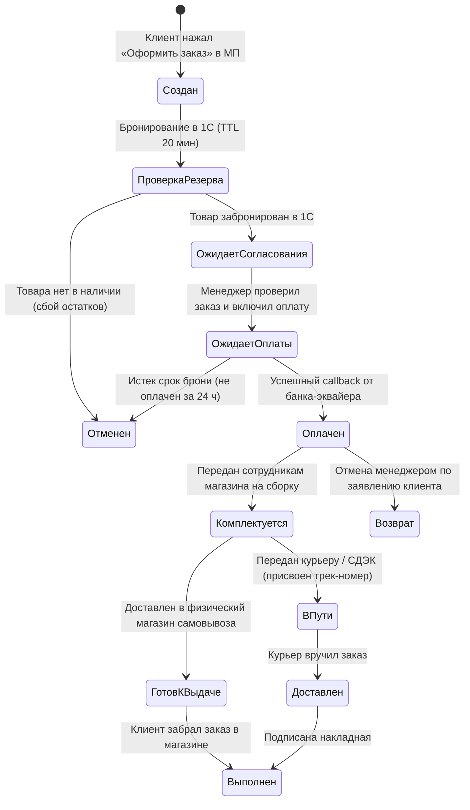

# ТЕХНИЧЕСКОЕ ЗАДАНИЕ
## на разработку цифрового продукта: [Название продукта / Мобильное приложение / Веб-портал]
### Проект: [Название проекта Заказчика]

---

### Реквизиты документа и статус согласования

* **Номер документа:** ТЗ-[ГОД]-[ПРОЕКТ]-01
* **Версия документа:** 1.0 (Финальная утвержденная)
* **Дата составления:** [ДД.ММ.ГГГГ]
* **Компания-разработчик:** IT-компания Xpage
* **Ведущий аналитик / PM (Xpage):** [ФИО, должность, e-mail, телефон]
* **Ответственный представитель Заказчика:** [ФИО, должность, e-mail, телефон]
* **Статус документа:** [ ] Черновик / [ ] На согласовании / [X] Утверждено к разработке

---

### Лист согласования

| Сторона | Роль в проекте | ФИО | Должность | Подпись | Дата |
|---|---|---|---|:---:|:---:|
| **Исполнитель (Xpage)** | Руководитель проектов (PM) | [Иванов И.И.] | Ведущий проджект-менеджер | ____________ | [ДД.ММ.ГГГГ] |
| **Исполнитель (Xpage)** | Архитектор / Lead Dev | [Петров П.П.] | Технический директор (CTO) | ____________ | [ДД.ММ.ГГГГ] |
| **Заказчик** | Владелец продукта (Product Owner) | [Сидоров С.С.] | Директор по цифровой трансформации | ____________ | [ДД.ММ.ГГГГ] |
| **Заказчик** | Куратор интеграций / IT-директор | [Алексеев А.А.] | Руководитель департамента IT | ____________ | [ДД.ММ.ГГГГ] |

---

### История изменений документа (Changelog)

| Версия | Дата | Автор изменений | Перечень внесенных изменений и раздел | Статус редакции |
|:---:|:---:|---|---|:---:|
| **0.1** | [Дата] | [Аналитик Xpage] | Первичный драфт на основе сметы и брифинга ППО | Черновик |
| **0.5** | [Дата] | [Аналитик Xpage] | Детализация разделов каталога, корзины и модуля ПЭП | На внутреннем ревью |
| **0.9** | [Дата] | [PM Xpage] | Внесены результаты технических созвонов по интеграциям с 1С и CRM | На согласовании Заказчиком |
| **1.0** | [Дата] | [PM Xpage] | Утвержденная редакция ТЗ, приложение к Договору разработки | Финал (Утверждено) |

---

> 💡 **ИНСТРУКЦИЯ ДЛЯ АНАЛИТИКА / PM XPAGE:**
> Данный документ является эталонным стандартом Технического задания компании Xpage, составленным на базе лучших практик реальных проектов разработки экосистем, ломбардных сервисов, порталов недвижимости и систем мониторинга данных. 
> Все текстовые фрагменты в квадратных скобках `[...]` подлежат заполнению проектной спецификой. Разделы, не применимые к конкретному продукту (например, модуль залоговых билетов для застройщика или калькулятор ипотеки для ломбарда), исключаются либо адаптируются.

---

## 1. Используемые термины и определения

> 💡 **ИНСТРУКЦИЯ ДЛЯ АНАЛИТИКА:** Включайте в данный раздел как общеотраслевые технические термины, так и узкоспециализированные бизнес-понятия Заказчика. Это исключает юридические и технические разночтения при приемо-сдаточных испытаниях.

1. **API (Application Programming Interface)** — стандартизированный программный интерфейс взаимодействия между клиентом (мобильное приложение, веб-сайт) и серверными компонентами по протоколу HTTPS с обменом структурированными сообщениями в формате JSON.
2. **Backend for Frontend (BFF) / API Gateway** — специализированный промежуточный серверный слой разработки Xpage, изолирующий внешние клиентские приложения от тяжелых внутренних учетных систем (1С, ERP), обеспечивающий кэширование, маршрутизацию, авторизацию и агрегацию данных.
3. **CMS (Content Management System) / Админ-панель** — веб-интерфейс администратора для оперативного управления динамическим контентом приложения (баннеры, сторис, FAQ, контакты, юридические оферты, модерация отзывов) без модификации исходного программного кода.
4. **NavBar (TabBar)** — сквозная нижняя панель навигации мобильного приложения, закрепленная в нижней части экрана и обеспечивающая переключение между корневыми разделами продукта в 1 тап.
5. **Header (Хедер)** — сквозная верхняя интерфейсная плашка страницы или экрана, содержащая контекстный заголовок, навигационную кнопку «Назад», профиль или поисковую строку.
6. **WebView** — системный компонент мобильной ОС, позволяющий безопасно отображать веб-страницы (например, страницу ввода банковской карты эквайринга или публичную оферту) непосредственно внутри мобильного приложения без перехода в сторонний браузер.
7. **Push-уведомление** — короткое системное или информационное сообщение, передаваемое сервером на устройство пользователя через службы нотификаций Apple APNs, Google FCM и RuStore Push SDK.
8. **DeepLink (Глубокая ссылка)** — специализированный URL/URI-адрес, позволяющий при переходе по ссылке (из SMS, Push-уведомления, мессенджера) открыть конкретный целевой экран внутри мобильного приложения (например, экран конкретного договора или заказа).
9. **Сквозной элемент** — структурная часть интерфейса, сохраняющая свое неизменное визуальное положение и базовый функционал на большинстве экранов продукта.
10. **Универсальный блок** — типовой переиспользуемый компонент верстки (баннерная карусель, блок «Вопрос-ответ», форма обратной связи, витрина товаров), логика поведения которого идентична, а наполнение формируется динамически.
11. **Empty State (Пустое состояние)** — специальный визуальный экран (или блок), отображаемый пользователю при отсутствии данных (пустая корзина, нет активных договоров, результаты поиска не найдены), обязательно содержащий пояснение и кнопку целевого действия (CTA).
12. **Skeleton Loading (Скелетон)** — анимированная серая заглушка, повторяющая форму будущего контента и отображаемая во время загрузки данных по сети для предотвращения ощущения «зависания» интерфейса.
13. **Мастер-система (Single Source of Truth)** — информационная система, признанная единственным первоисточником конкретного набора данных, изменения из которой обладают наивысшим приоритетом при синхронизации и разрешении коллизий.
14. **Оверселлинг (Overselling)** — критическая аварийная коллизия интернет-торговли, при которой уникальный или штучный товар одновременно продается двум разным покупателям из-за задержек синхронизации складских остатков.
15. **Таймаут бронирования (TTL — Time to Live)** — временной интервал, на который товар или финансовый лимит блокируется в учетной системе за конкретным покупателем до момента поступления оплаты.
16. **ПЭП (Простая электронная подпись)** — электронная подпись, которая посредством использования кодов, паролей или иных идентификаторов подтверждает факт формирования электронной подписи определенным лицом (в соответствии с Федеральным законом № 63-ФЗ «Об электронной подписи»).
17. **Договор займа / Залоговый билет** — электронный или бумажный документ, подтверждающий факт передачи имущества в залог и выдачи денежных средств заемщику под процент на установленный срок.
18. **Договор хранения** — документ, регламентирующий передачу имущества клиента на ответственное хранение в ломбард/склад с установленным периодом бесплатного хранения и последующей тарификацией.
19. **Оценка имущества** — бизнес-процесс предварительного определения оценочной стоимости залогового или выкупного имущества (ювелирные изделия, электроника, авто) экспертом-оценщиком на основании переданных клиентом параметров и фотоматериалов.
20. **Интернет-эквайринг** — технология приема безналичных платежей банковскими картами и альтернативными платежными методами через защищенный платежный шлюз банка-эквайера.
21. **СБП (Система быстрых платежей)** — сервис Банка России, позволяющий физическим лицам совершать мгновенные платежи в пользу юридических лиц по QR-коду или платежной ссылке с вызовом нативного банковского приложения.
22. **Фискализация (54-ФЗ)** — процесс формирования кассового чека в фискальном накопителе аккредитованной контрольно-кассовой техники (ККТ/облачной кассы) с передачей данных оператору фискальных данных (ОФД) и отправкой электронного чека покупателю.
23. **Черный список («ЧС» / Стоп-лист)** — системный признак учетной записи пользователя в базе данных Заказчика, накладывающий полный запрет на совершение онлайн-сделок, займов и финансово значимых операций.
24. **Персональные данные (ПДн)** — любая информация, относящаяся к прямо или косвенно определенному физическому лицу (субъекту персональных данных), обрабатываемая в строгом соответствии с 152-ФЗ.

---

## 2. Назначение, цели и задачи проекта

### 2.1. Назначение системы
[Указать краткое назначение продукта. Например: «Разрабатываемый программный комплекс представляет собой кроссплатформенное мобильное приложение для платформ iOS и Android, интегрированное с корпоративной учетной системой 1С и CRM-системой Битрикс24 Заказчика, предназначенное для автоматизации обслуживания клиентов ломбардной сети, онлайн-управления договорами займов/хранения, витрины комиссионного интернет-магазина и проведения защищенных онлайн-платежей».]

### 2.2. Бизнес-цели и критерии успеха проекта (KPI)
Внедрение продукта направлено на достижение следующих измеримых показателей:
* **Перевод финансового обслуживания в онлайн:** достижение доли онлайн-платежей по процентам и договорам не менее [40%] от общего объема транзакций в течение [6] месяцев с момента релиза.
* **Сокращение операционных издержек:** разгрузка сотрудников розничных отделений за счет снижения рутинного потока консультаций и приема платежей на [25%].
* **Ускорение обработки интернет-заказов:** сокращение среднего времени от момента добавления товара в корзину до согласования и выставления платежной ссылки менеджером до [< 7 минут].
* **Повышение LTV и Retention:** обеспечение показателя возврата пользователей (Retention 30-го дня) на уровне не менее [35%] за счет внедрения push-нотификаций и программы лояльности.

### 2.3. Задачи разработки (Scope of Work)
В рамках договора Исполнитель выполняет следующий объем работ:
1. Проектирование пользовательских сценариев (User Flow) и интерактивных прототипов ключевых экранов в Figma.
2. Создание дизайн-системы, UI-Kit и финальных дизайн-макетов всех экранов продукта.
3. Кроссплатформенная разработка клиентского мобильного приложения (на базе Flutter/Dart) под ОС iOS и Android.
4. Разработка серверного интеграционного шлюза BFF (Backend for Frontend) на современном стеке технологий.
5. Реализация двусторонней интеграции с учетной системой Заказчика ([1С:Предприятие 8.3 / ERP]) в соответствии с протоколами API.
6. Реализация интеграции с CRM-системой ([Битрикс24]) для омниканальной передачи чатов и сделок.
7. Интеграция с платежным шлюзом банка-эквайера ([Наименование Банка]) и сервисом фискализации чеков (54-ФЗ).
8. Интеграция с шлюзом рассылки SMS-сообщений и мультиплатформенными Push-сервисами (APNs, FCM, RuStore).
9. Интеграция с картографическим сервисом (API Яндекс.Карт).
10. Разработка административной панели (CMS) для контент-менеджмента и модерации.
11. Комплексное тестирование (функциональное, интеграционное, регрессионное, нагрузочное).
12. Подготовка сборок, прохождение модерации и публикация мобильного приложения в магазинах App Store, Google Play и RuStore.

### 2.4. Границы проекта и явные исключения (Out of Scope)
> 💡 **ИНСТРУКЦИЯ ДЛЯ АНАЛИТИКА:** Четко зафиксируйте, что НЕ входит в скоуп текущего контракта во избежание «расползания границ» (Scope Creep).

* В рамках текущей версии продукта **НЕ разрабатывается:**
  * Функционал автоматического скоринга заемщиков и выдачи займов без участия сотрудника-оценщика (перенесено на Фазу 2).
  * Механизм сплитования платежей (оплата долями / BNPL-сервисы).
  * Автоматический онлайн-расчет доставки негабаритных грузов транспортными компаниями (расчет осуществляется оператором вручную).
  * Модуль оптовой торговли (B2B-кабинет).
* **Разграничение ответственности по доработкам:**
  * Все доработки конфигураций внутренних учетных систем Заказчика ([1С, ERP, локальные базы данных]) и публикация необходимых API-методов выполняются силами и за счет Заказчика.
  * Оплата внешних сервисов (SMS-трафик, комиссии банковского эквайринга, подписки на карты Яндекс, годовые аккаунты разработчика Apple Developer Program и Google Play Console) осуществляется Заказчиком напрямую провайдерам.

---

## 3. Пользовательские роли и модель доступа (RBAC)

### 3.1. Реестр ролей пользователей

| Код роли | Наименование роли | Описание профиля | Интерфейс доступа |
|---|---|---|---|
| `ROLE_GUEST` | Неавторизованный гость | Любой пользователь, установивший приложение, но не подтвердивший номер телефона. Доступ к промо-материалам, каталогу и контактам. | Мобильное приложение |
| `ROLE_CLIENT` | Авторизованный клиент | Пользователь, прошедший валидацию номера телефона через SMS OTP-код. Доступ к корзине, оформлению заказов, чату поддержки. | Мобильное приложение |
| `ROLE_VERIFIED` | Верифицированный клиент (ПЭП) | Клиент, прошедший процедуру идентификации личности (паспортные данные / Госуслуги) и подписавший соглашение о ПЭП. Доступ к займам и подписанию договоров. | Мобильное приложение |
| `ROLE_BLOCKED` | Заблокированный клиент («ЧС») | Пользователь, получивший признак ЧС из службы безопасности / 1С. Сессия принудительно завершается, финансовые действия блокируются. | Мобильное приложение |
| `ROLE_OPERATOR` | Оператор / Менеджер филиала | Сотрудник розничного отделения Заказчика, обрабатывающий заявки, формирующий платежные ссылки и консультирующий клиентов. | CRM (Битрикс24) |
| `ROLE_CMS_ADMIN` | Контент-менеджер CMS | Администратор, управляющий баннерами, промо-акциями, текстами оферт и модерацией отзывов. | Панель администрирования |
| `ROLE_SUPERADMIN` | Суперадминистратор системы | Технический специалист с полными правами управления ролями, конфигурациями шлюза и просмотром системных журналов. | Панель администрирования |

### 3.2. Матрица прав доступа к сущностям и операциям (CRUD)

| Сущность / Модуль | ROLE_GUEST | ROLE_CLIENT | ROLE_VERIFIED | ROLE_BLOCKED | ROLE_CMS_ADMIN | ROLE_SUPERADMIN |
|---|:---:|:---:|:---:|:---:|:---:|:---:|
| Каталог товаров и поиск | R | R | R | R | R/W | CRUD |
| Корзина и добавление в корзину | R/W (локально) | CRUD | CRUD | Denied | — | CRUD |
| Создание интернет-заказа | Denied | Create/Read | Create/Read | Denied | — | CRUD |
| Отмена оформленного заказа | Denied | Denied (через оператора) | Denied (через оператора) | Denied | R/W (в CRM) | CRUD |
| Просмотр договоров займа и залогов | Denied | Denied | Read (свои) | Denied | — | Read |
| Оплата процентов / продление займа | Denied | Denied | Create/Read | Denied | — | Read |
| Подписание документов через ПЭП | Denied | Denied | Create (SMS OTP) | Denied | — | Read (аудит) |
| Отправка заявки на онлайн-оценку | Denied | Create/Read | Create/Read | Denied | — | Read |
| Онлайн-чат с оператором | Denied | Create/Read | Create/Read | Denied | R/W (в CRM) | Read |
| Управление баннерами и сторис | Denied | Denied | Denied | Denied | CRUD | CRUD |
| Просмотр журнала аудита (Audit Trail) | Denied | Denied | Denied | Denied | Denied | Read Only |

*Условные обозначения: R — Read (просмотр), W — Write (создание/редактирование), CRUD — полный доступ, Denied — доступ заблокирован на уровне контроллера API.*

### 3.3. Сессионная политика и безопасность сессий
* **Аутентификация:** По протоколу OAuth 2.0 / JWT (JSON Web Tokens). При успешной валидации клиенту выдается пара токенов:
  * `Access Token` — срок жизни 15 минут, используется для авторизации запросов к BFF.
  * `Refresh Token` — срок жизни 30 дней, хранится в зашифрованном системном хранилище мобильного устройства (EncryptedSharedPreferences на Android, Keychain на iOS).
* **Биометрия:** При повторном открытии приложения доступ подтверждается биометрией (Face ID / Touch ID) или 4-значным PIN-кодом без повторной отправки SMS.
* **Принудительный разлогин (ЧС / смена номера):** При получении флага блокировки учетной записи (`is_blocked = true`) от 1С бэкенд BFF мгновенно инвалидирует Refresh Token, сессия прерывается, а экран блокируется.

---

## 4. Системная архитектура и ландшафт решения

### 4.1. Архитектурная топология системы

```mermaid
graph TD
    subgraph Клиентский слой (Frontend)
        A[iOS Mobile App - Flutter]
        B[Android Mobile App - Flutter]
        C[Web Portal / Каталог]
    end

    subgraph Защищенный контур Xpage (BFF Layer)
        D[Nginx Reverse Proxy / WAF / SSL]
        E[API Gateway / BFF Service]
        F[(Redis Cache - Справочники и Сессии)]
        G[(PostgreSQL - Заказы, Контент, Аудит-лог)]
        H[RabbitMQ - Шина асинхронных очередей]
        I[CMS Admin Panel]
    end

    subgraph Инфраструктурный контур Заказчика
        J[1С:Предприятие 8.3 / ERP]
        K[CRM Битрикс24 - Открытые линии]
        L[Файловый архив PDF-договоров]
    end

    subgraph Внешние провайдеры и шлюзы
        M[Банк-Эквайринг - Оплата / СБП]
        N[Облачная касса 54-ФЗ]
        O[SMS Шлюз рассылок]
        P[Push: APNs / FCM / RuStore]
        Q[API Яндекс.Карт]
        R[API Службы доставки - СДЭК]
    end

    A & B & C -->|HTTPS / TLS 1.3| D
    D --> E
    I --> E
    E <--> F
    E <--> G
    E <--> H

    H <-->|Асинхронные очереди / Retry| J
    E <-->|REST API / Webhooks| K
    J --> L

    E <-->|REST API / Callbacks| M
    M -->|Фискализация| N
    E -->|REST API| O
    E -->|Push SDK| P
    A & B & C -->|Tiles / SDK| Q
    E <-->|REST API| R
```

### 4.2. Роль слоя BFF (Backend for Frontend) и изоляция 1С
* **Изоляция учетной системы:** Клиентские мобильные приложения ни при каких обстоятельствах не обращаются к серверу 1С Заказчика напрямую. Все запросы принимает BFF.
* **Кэширование:** Статические и условно-постоянные данные (дерево категорий, справочники городов, адреса филиалов, курсы драгоценных металлов) кэшируются в оперативной памяти Redis. Время жизни кэша (TTL) составляет от 15 до 60 минут с возможностью принудительного сброса по Webhook из 1С.
* **Буферизация транзакций (RabbitMQ):** При оформлении заказа или проведении платежа событие помещается в очередь брокера сообщений. При временной недоступности 1С запрос не теряется, а удерживается в очереди и доставляется по регламенту экспоненциального повтора (Retry Policy: попытки через 30с, 1м, 5м, 15м, 1ч).

### 4.3. Определение мастер-систем (Single Source of Truth)

| Сущность | Мастер-система | Направление синхронизации | Периодичность / Триггер |
|---|---|---|---|
| Номенклатура товаров и цены | 1С Заказчика | 1С -> BFF -> Приложение | Дельта-пакеты каждые 15 мин + вебхук на изменение |
| Складские остатки и резервы | 1С Заказчика | 1С <-> BFF | В реальном времени (Online API) при оформлении |
| Статусы договоров займа / хранения | 1С Заказчика | 1С -> BFF -> Приложение | При входе в ЛК клиента + WebSocket-уведомление |
| Статусы интернет-заказов | CRM Битрикс24 | CRM <-> 1С <-> BFF | В реальном времени по событию смены статуса менеджером |
| Контент баннеров, сторис, FAQ | CMS Xpage | CMS -> BFF -> Приложение | В реальном времени при сохранении в админке |
| Чат и переписка с клиентами | CRM Битрикс24 | Приложение <-> BFF <-> CRM | Двусторонний WebSocket в реальном времени |

---

## 5. Структура интерфейсов и сквозные элементы

### 5.1. Дерево разделов и карта экранов продукта (Sitemap)

```
1. Контур инициализации
   1.1. Сплэш-экран (Загрузка конфигураций)
   1.2. Онбординг (Слайдер преимуществ для новых пользователей)
   1.3. Экран выбора города присутствия
2. Контур аутентификации
   2.1. Экран ввода номера телефона
   2.2. Экран подтверждения кода (SMS OTP / Звонок)
   2.3. Экран установки PIN-кода и включения Face ID/Touch ID
   2.4. Экран блокировки («Черный список»)
3. Корневые разделы (Нижняя навигация NavBar)
   3.1. Главный экран (Дашборд, баннеры, курсы металлов, персональные предложения)
   3.2. Каталог товаров
        3.2.1. Разводящий экран категорий
        3.2.2. Листинг товаров с фильтрами и сортировкой
        3.2.3. Карточка товара (Детальный просмотр, фото-слайдер, характеристики)
   3.3. Онлайн-оценка (Мастер заявки на оценку имущества)
   3.4. Оплата (Быстрый поиск договора/билета по номеру и оплата)
   3.5. Профиль (Личный кабинет)
4. Разделы Личного кабинета
   4.1. Раздел «Мои договоры»
        4.1.1. Договоры займа (Детальный расчет, пролонгация, гашение)
        4.1.2. Договоры хранения (Условия, оплата, перевод в залог)
        4.1.3. Архив закрытых договоров
   4.2. Раздел «Мои интернет-заказы» (Список заказов, детальный экран, трекинг)
   4.3. Модуль Простой электронной подписи (ПЭП)
        4.3.1. Экран статуса ПЭП и соглашений
        4.3.2. Форма идентификации (Паспорт / ЕСИА)
        4.3.3. Экран просмотра и подписания PDF-документа
   4.4. Раздел «Бонусы и Программа лояльности»
   4.5. Настройки профиля, уведомлений и безопасности
5. Контур интернет-магазина (Чекаут)
   5.1. Экран корзины товаров
   5.2. Экран выбора способа получения (Самовывоз / Доставка)
   5.3. Экран подтверждения и оплаты заказа
6. Коммуникационный контур
   6.1. Центр диалогов (Чат поддержки / Чат по конкретному заказу / Чат оценки)
   6.2. Центр системных PUSH-уведомлений
7. Информационные разделы
   7.1. Интерактивная карта филиалов и ломбардов (Яндекс.Карты)
   7.2. Акции и спецпредложения
   7.3. Вопрос-ответ (FAQ)
   7.4. Правовая информация и оферты
```

### 5.2. Сквозная навигационная панель (NavBar / TabBar)
Панель закреплена в нижней части дисплея для всех экранов первого уровня:
1. **Главная:** Иконка «Дом». Переход к Главному экрану (п. 6.3).
2. **Каталог:** Иконка «Витрина / Сетка». Переход в каталог товаров (п. 6.4).
3. **Оценка:** Иконка «Калькулятор / Оценка». Переход в мастер оценки имущества (п. 6.8.2).
4. **Оплата:** Иконка «Банковская карта». Переход к быстрой оплате по номеру договора (п. 6.7).
5. **Профиль:** Иконка «Пользователь». Переход в Личный кабинет (п. 6.6).
*Правила поведения:* При наличии активных заказов, требующих оплаты, или непрочитанных сообщений в чате на соответствующих иконках отображается бейдж с количеством событий.

### 5.3. Сквозной Хедер (Header)
* **Левая часть:** Для экранов верхнего уровня — кнопка выбора текущего города присутствия (с отображением названия текущего города). Для дочерних экранов — нативная стрелка «Назад» с возвратом на предыдущий экран стека навигации.
* **Центральная часть:** Контекстный заголовок текущего экрана или логотип компании (на Главной).
* **Правая часть:** Иконка «Колокольчик» (переход в Центр уведомлений) и иконка «Корзина» с динамическим счетчиком добавленных позиций.

### 5.4. Универсальные UI-блоки
1. **Баннерный слайдер:** Поддержка циклической прокрутки, шаг свайпа 1 баннер, таймер автоматической смены 5 секунд (приостанавливается при удержании пальцем), индикаторы-точки внизу слайдера. По клику отрабатывает Deeplink на внутренний раздел приложения либо открытие внешнего URL в безопасном браузере.
2. **Блок «Вопрос-ответ» (Accordion FAQ):** Вертикальный список заголовков вопросов. По тапу блок плавно разворачивается вниз, раскрывая текстовый ответ с поддержкой форматирования и ссылок. Одновременно может быть раскрыт только один вопрос.
3. **Блок «Форма обратной связи»:** Поля ввода имени, телефона, темы обращения, текстового комментария и обязательный чекбокс согласия с политикой обработки персональных данных.

### 5.5. Типовые состояния экранов
* **Loading State (Загрузка):** Отображение мерцающего скелетона (Skeleton), повторяющего геометрию загружаемых карточек или списков. Запрещается блокировать экран полноэкранным спиннером без возможности навигации.
* **Empty State (Пустое состояние):** Если список пуст (нет заказов, корзина пуста, поиск не дал результатов) — отображается тематическая векторная иллюстрация, понятный заголовок, поясняющий текст и акцентная кнопка CTA (например, «Перейти к покупкам»).
* **Error State (Ошибка загрузки / сбой API):** Выводится экран ошибки с текстом «Не удалось загрузить данные. Проверьте интернет-соединение» и кнопкой «Повторить попытку».
* **Offline Banner:** При потере интернет-соединения в верхней части экрана плавно выезжает информационная желтая плашка «Отсутствует подключение к интернету. Данные могут быть неактуальны».

---

## 6. Детальные функциональные требования к разделам и экранам

### 6.1. Онбординг и Сплэш-экран

#### 6.1.1. Назначение и прототип
* **Назначение:** Первичная инициализация мобильного приложения, загрузка конфигураций шлюза и краткая презентация возможностей новому пользователю.
* **Прототип:** [Figma: Screen_01_Splash & Screen_02_Onboarding]

#### 6.1.2. Элементы интерфейса и логика работы
1. **Сплэш-экран:** Фоновое изображение в фирменном стиле Xpage, корпоративный логотип Заказчика, системный индикатор загрузки. Во время показа сплэш-экрана (не более 1.5 сек) приложение выполняет:
   * Запрос к API BFF для проверки актуальности версии сборки (проверка Force Update).
   * Проверку наличия сохраненного токена авторизации в Secure Storage.
   * Если пользователь запустил приложение впервые — осуществляется переход на экран Онбординга.
   * Если пользователь ранее авторизован — переход на экран ввода PIN-кода / биометрии.
   * Если пользователь не был авторизован — переход на Главный экран в роли `ROLE_GUEST`.
2. **Экран Онбординга:** Слайдер из 3-4 экранов с иллюстрациями и кратким описанием функционала:
   * Слайд 1: «Управляйте займами онлайн — продлевайте договоры не выходя из дома».
   * Слайд 2: «Каталог проверенной техники и ювелирных изделий с гарантией».
   * Слайд 3: «Онлайн-оценка имущества за 5 минут без визита в отделение».
3. **Элементы управления онбординга:**
   * Кнопка «Пропустить» (в правом верхнем углу) — досрочно завершает просмотр и переводит на Главный экран.
   * Точечные индикаторы текущей страницы слайдера.
   * Кнопка «Далее» (на последнем слайде меняется на «Начать пользоваться»).

---

### 6.2. Авторизация и регистрация пользователя

#### 6.2.1. Назначение и прототип
* **Назначение:** Единая точка входа для регистрации новых и авторизации действующих клиентов по номеру мобильного телефона.
* **Прототип:** [Figma: Screen_03_Auth_Phone & Screen_04_Auth_OTP]

#### 6.2.2. Элементы интерфейса и источники данных

| Элемент UI | Тип элемента | Источник данных | Валидация и поведение |
|---|---|---|---|
| Кнопка «Войти как гость» | Текстовая ссылка | Статика | Закрывает шторку авторизации, сохраняет статус `ROLE_GUEST`. |
| Поле ввода телефона | Текстовый Input с маской | Ввод пользователя | Маска РФ: `+7 (XXX) XXX-XX-XX`. Строго 10 цифр ввода. Валидация операторов связи РФ. |
| Способ доставки кода | Селектор / Radio | Настройки BFF | Варианты: СМС-сообщение / Звонок-сброс / Telegram. По умолчанию активен «СМС». |
| Кнопка «Получить код» | Основная CTA-кнопка | Статика | Неактивна (Disabled), пока номер телефона не введен полностью. |
| Поле ввода OTP-кода | 4-значный пин-панель | Ввод пользователя | Автоматический фокус на первую ячейку. Поддержка автоподстановки из системных SMS (iOS/Android). |
| Таймер повторной отправки | Динамический текст | Клиентский таймер | Обратный отсчет 60 секунд. По истечении таймера активируется ссылка «Отправить код повторно». |

#### 6.2.3. Пользовательские сценарии (Use Cases)

* **Сценарий 6.2.3.1. Успешный вход существующего клиента:**
  1. Пользователь вводит номер телефона и нажимает «Получить код».
  2. BFF выполняет проверку Rate Limit (не более 3 запросов в 10 минут с одного IP/номера) и инициирует отправку через SMS-шлюз.
  3. Клиент вводит верный 4-значный код из SMS.
  4. BFF отправляет запрос проверки в 1С. 1С находит контрагента по номеру телефона и возвращает его профиль (ФИО, признак наличия договоров, баланс бонусов, статус ЧС).
  5. Приложение сохраняет токены, предлагает настроить быстрый вход по биометрии (Face ID / PIN) и перенаправляет на Главный экран в статусе `ROLE_CLIENT`.

* **Сценарий 6.2.3.2. Регистрация нового клиента:**
  1. Если после ввода OTP-кода номер телефона не найден в 1С Заказчика, открывается компактный экран «Регистрация нового пользователя».
  2. Клиент заполняет обязательные поля: «Фамилия», «Имя», «Отчество» (опционально), «E-mail» (для отправки чеков по 54-ФЗ).
  3. Клиент проставляет обязательный чекбокс: «Я даю согласие на обработку персональных данных и принимаю условия Пользовательского соглашения».
  4. По нажатию «Зарегистрироваться» BFF создает учетную запись в БД и отправляет команду создания нового контрагента в 1С.

* **Сценарий 6.2.3.3. Обработка клиента из «Черного списка» (ЧС):**
  1. Если в ответе от 1С возвращен параметр `is_blocked = true`, авторизация прерывается.
  2. На экране отображается модальное окно: «Обслуживание через мобильное приложение временно приостановлено. Для уточнения информации обратитесь в контакт-центр по телефону 8-800-XXX-XX-XX либо в ближайшее отделение».
  3. Любые дальнейшие действия внутри личного кабинета блокируются.

---

### 6.3. Главный экран (Дашборд)

#### 6.3.1. Назначение и прототип
* **Назначение:** Основная витрина продукта, агрегирующая персональные финансовые показатели клиента, актуальные маркетинговые акции, котировки металлов и быстрый доступ к ключевым операциям.
* **Прототип:** [Figma: Screen_05_Dashboard_Authorized & Screen_06_Dashboard_Guest]

#### 6.3.2. Структура блоков Главного экрана
1. **Хедер экрана:** Логотип, селектор текущего города, иконка уведомлений с красным бейджем непрочитанных, аватар/иконка профиля.
2. **Персональный финансовый виджет (только для `ROLE_VERIFIED`):**
   * Карточка активного займа: сумма текущей задолженности, начисленные проценты, дата ближайшего платежа.
   * Кнопка быстрого действия «Оплатить проценты / продлить» (переход к экрану оплаты).
   * Бейдж доступного предварительно одобренного лимита займа (например: «Вам доступно до 150 000 ₽»).
3. **Баннерный слайдер:** Динамические промо-баннеры, управляемые из CMS Xpage (акции, скидки на ювелирные изделия, условия скупки техники).
4. **Виджет «Курсы металлов»:** Информационный блок с текущей стоимостью за 1 грамм золота/серебра в скупке и залоге по категориям (585°, 750°, 999°). Данные обновляются раз в сутки из справочника 1С.
5. **Блок быстрого доступа (Quick Actions):** Сетка из 4 круглых кнопок:
   * «Оценить онлайн» -> переход в мастер оценки.
   * «Каталог товаров» -> переход в интернет-магазин.
   * «Адреса отделений» -> открытие интерактивной карты.
   * «Чат с экспертом» -> открытие консультационного чата.
6. **Блок «Популярные товары витрины»:** Горизонтальная карусель карточек товаров со статусом «Хит продаж» или «Спеццена» (подтягивается из каталога).

---

### 6.4. Каталог товаров, поиск и карточка товара

#### 6.4.1. Назначение и прототип
* **Назначение:** Просмотр комиссионных товаров и невыкупленного залогового имущества, поиск по параметрам, фильтрация и добавление товаров в корзину.
* **Прототип:** [Figma: Screen_07_Catalog_Tree, Screen_08_Product_List, Screen_09_Product_Detail]

#### 6.4.2. Элементы интерфейса и логика работы
1. **Поисковая строка:** Расположена в верхней части экрана каталога. Позволяет осуществлять поиск по наименованию, бренду, модели, артикулу или серийному номеру. Поддерживает автодополнение (подсказки при вводе от 3 символов).
2. **Панель сортировки и фильтрации:**
   * Кнопка вызова шторки «Фильтры» (с индикатором количества примененных фильтров).
   * Выпадающий список сортировки: «Сначала дешевле», «Сначала дороже», «По новизне», «По размеру скидки».
3. **Шторка фильтров (Bottom Sheet):**
   * Фильтр по диапазону цен: поля «От» и «До» с ползунком Dual Slider.
   * Фильтр по наличию: чекбокс «Только в моем городе».
   * Специфические категорийные фильтры (формируются динамически в зависимости от категории):
     * Для ювелирных изделий: вид металла, проба (375, 585, 750, 925), размер кольца/цепи, наличие драгоценных вставок, вес изделия.
     * Для электроники: бренд, объем памяти, состояние (Идеальное / Хорошее / С дефектами), комплектация.
   * Кнопки управления: «Сбросить все» и «Применить фильтры (показать N товаров)».
4. **Листинг товаров (Сетка в 2 колонки):**
   * Карточка товара содержит: интерактивный свайп-слайдер фото (прямо в листинге без перехода вглубь), бейдж скидки/состояния, наименование, текущая цена, старая перечеркнутая цена, город/адрес нахождения товара, кнопка «В корзину» (или «Выбрать», если товар требует уточнения параметров).
5. **Детальная карточка товара:**
   * Полноэкранная галерея фотографий с возможностью зума (Pinch-to-zoom).
   * Блок видеообзора товара (если прикреплен в 1С/CRM).
   * Полный перечень технических характеристик, экспертное описание дефектов/царапин, серийный номер.
   * Адрес физического магазина, в котором товар находится на витрине, и часы его работы.
   * Блок «Условия гарантии и возврата».
   * Нижняя фиксированная панель: текущая стоимость, начисление бонусов за покупку, кнопка «Добавить в корзину» и кнопка «Купить в 1 клик / Написать продавцу».

---

### 6.5. Корзина товаров и оформление заказа

#### 6.5.1. Назначение и прототип
* **Назначение:** Проверка состава заказа, управление количеством, выбор способа получения и инициация процедуры бронирования/оплаты.
* **Прототип:** [Figma: Screen_10_Cart & Screen_11_Checkout]

#### 6.5.2. Специфика штучных товаров и логика резервирования
> 💡 **ИНСТРУКЦИЯ ДЛЯ АНАЛИТИКА:** В комиссионной торговле и ломбардах 95% товаров — это уникальные штучные б/у изделия (Single Item). Важно явно зафиксировать правила предотвращения коллизий.

1. **Ограничение количества:** Для уникальных б/у позиций кнопки изменения количества «+ 1 -» блокируются, количество строго равно 1 шт.
2. **Проверка остатков при входе в корзину:** При открытии экрана корзины BFF выполняет экспресс-запрос в 1С на проверку актуальности статуса позиций. Если товар был продан офлайн в магазине за время нахождения в корзине, карточка товара блокируется серым цветом, выводится бейдж «Товар продан» и кнопка «Удалить из корзины».
3. **Резервирование товара (Hold):**
   * При переходе к шагу оформления заказа (кнопка «Оформить заказ») товар блокируется в 1С со статусом «В интернет-резерве».
   * Включается системный таймер резерва: **20 минут** на завершение оплаты.
   * На экране отображается предупреждение: «Товар забронирован за вами на 20 минут. Пожалуйста, завершите оплату».
   * По истечении 20 минут, если оплата не поступила, бронь автоматически аннулируется, товар возвращается на публичную витрину.

#### 6.5.3. Способы получения заказа
* **Способ 1. Самовывоз из магазина:** Бесплатно. Доступен только в том магазине, где физически находится товар. Клиент выбирает дату и время визита.
* **Способ 2. Курьерская доставка по городу:** Доступна для товаров в черте выбранного города. Клиент указывает точный адрес, подъезд, этаж, домофон.
* **Способ 3. Доставка транспортной компанией (СДЭК / Почта РФ):** Доступна для межгорода. Клиент выбирает удобный пункт выдачи заказов (ПВЗ) на интерактивной карте. Стоимость доставки рассчитывается менеджером после подтверждения параметров отправки.

---

### 6.6. Личный кабинет: Управление договорами займов и залоговыми билетами

#### 6.6.1. Назначение и прототип
* **Назначение:** Предоставление клиенту полной финансовой информации по его открытым договорам займа, залоговым билетам и договорам хранения с возможностью удаленной пролонгации и закрытия.
* **Прототип:** [Figma: Screen_12_Contracts_List, Screen_13_Contract_Detail]

#### 6.6.2. Элементы интерфейса детального экрана залогового билета

| Элемент UI | Источник данных | Описание и валидация |
|---|---|---|
| Номер залогового билета | 1С Заказчика | Уникальный буквенно-цифровой номер (например: `ЗБ-74-004581`). |
| Статус договора | 1С Заказчика | «Действует» (зеленый) / «Льготный период» (желтый) / «Просрочен / Реализация» (красный). |
| Сумма займа (тело долга) | 1С Заказчика | Исходная сумма выданных клиенту денежных средств в рублях. |
| Начисленные проценты | 1С Заказчика | Сумма процентов за пользование займом на текущую дату. |
| Дата окончания срока займа | 1С Заказчика | Календарная дата окончания основного срока договора. |
| Дата окончания льготного месяца | 1С Заказчика | Предельная дата, до которой имущество не подлежит реализации по закону. |
| Опись заложенного имущества | 1С Заказчика | Наименование предметов залога, проба, вес, оценочная стоимость. |
| Кнопка «Скачать электронный договор» | 1С Заказчика | Скачивание и открытие юридического PDF-файла договора с отметкой ПЭП. |
| Кнопка «Оплатить проценты (продлить)» | Расчет 1С | Инициирует сценарий оплаты только суммы начисленных процентов с пролонгацией срока займа на новый период (30 дней). |
| Кнопка «Погасить займ полностью» | Расчет 1С | Инициирует оплату тела займа + процентов с переводом договора в статус «Ожидает выдачи имущества в отделении». |

---

### 6.7. Раздел быстрых оплат

#### 6.7.1. Назначение и прототип
* **Назначение:** Оплата залогового билета или договора займа без обязательной авторизации в профиле (например, оплата родственниками заемщика).
* **Прототип:** [Figma: Screen_14_Quick_Pay]

#### 6.7.2. Логика работы
1. Пользователь вводит номер залогового билета и фамилию заемщика для верификации.
2. BFF отправляет запрос в 1С. 1С выполняет сверку и возвращает сумму, необходимую для минимального продления, и сумму полного закрытия.
3. Пользователь выбирает вариант оплаты, вводит e-mail для отправки кассового чека (54-ФЗ) и перенаправляется на шлюз интернет-эквайринга.
4. После успешной оплаты 1С фиксирует поступление средств, договор продлевается автоматически, а плательщику выводится электронная квитанция.

---

### 6.8. Коммуникации: Онлайн-чат, Оценка имущества и Центр Push-уведомлений

#### 6.8.1. Онлайн-чат поддержки и консультаций
* Чат интегрируется с Открытыми линиями CRM Битрикс24 Заказчика.
* Клиент может прикреплять фотографии и файлы (до 15 Мб).
* Поддержка системных сообщений (статусы «Оператор печатает...», «Сообщение прочитано»).
* Возможность передачи интерактивных карточек товаров и ссылок на оплату прямо в ленту диалога.

#### 6.8.2. Мастер онлайн-оценки имущества
* Шаг 1: Выбор типа имущества (Ювелирные изделия / Электроника / Автотранспорт / Часы).
* Шаг 2: Ввод технических параметров (проба, вес, бренд, модель, год выпуска, дефекты).
* Шаг 3: Обязательная фотофиксация: экран содержит силуэтные подсказки для фото (общий вид, клеймо/проба крупным планом, дефекты, чек/коробка).
* Шаг 4: Отправка заявки. Заявка падает в CRM оценщику, в приложении автоматически создается контекстный чат оценки с экспертом ломбарда.

#### 6.8.3. Центр PUSH-уведомлений
* Раздел в профиле, сохраняющий историю всех отправленных нотификаций за последние 90 дней.
* Деление по вкладкам: «Все», «Операции и платежи», «Акции и скидки».
* Клик по уведомлению отрабатывает Deeplink на соответствующий экран.

---

## 7. Сквозные бизнес-сценарии и логика состояний (State Machines)

### 7.1. Жизненный цикл интернет-заказа



### 7.2. Жизненный цикл договора займа / залогового билета
1. **Выдача займа (в отделении):** Создание залогового билета в 1С, присвоение уникального номера, передача в ЛК мобильного приложения.
2. **Период действия (Основной срок):** Начисление процентов согласно индивидуальным условиям договора. Статус: `ACTIVE`.
3. **Льготный период (Grace Period):** Наступает на следующий день после даты возврата займа по договору. Длится 30 календарных дней согласно ФЗ № 196 «О ломбардах». Ломбард не имеет права реализовать имущество. Статус: `GRACE_PERIOD`.
4. **Пролонгация (Продление):** Клиент оплачивает начисленные проценты онлайн в МП. 1С сдвигает срок окончания договора на 30/60 дней вперед. Статус возвращается в `ACTIVE`.
5. **Полное погашение:** Клиент выплачивает тело долга + остаток процентов. Статус меняется на `REDEEMED` («Погашен, ожидает выдачи предмета залога в отделении»).
6. **Реализация (Невыкупленный залог):** По истечении льготного месяца имущество передается на оценку и выгружается на витрину интернет-магазина. Договор переходит в статус `CLOSED_UNREDEEMED`.

### 7.3. Сценарий оформления и подписания Простой электронной подписи (ПЭП, 63-ФЗ)
1. **Инициирование:** Клиент в разделе профиля нажимает кнопку «Оформить простую электронную подпись».
2. **Шаг 1. Согласие с правилами:** Клиент знакомится с Положением об электронном документообороте и проставляет чекбокс «Принимаю условия соглашения о ПЭП».
3. **Шаг 2. Ввод паспортных данных:** Клиент заполняет серию, номер паспорта, дату выдачи, код подразделения, кем выдан, дату и место рождения, адрес регистрации.
4. **Шаг 3. Фотофиксация:** Клиент загружает фото 2-й и 3-й страниц паспорта (разворот с фото) и фото страницы с действующей регистрацией.
5. **Шаг 4. Сверка данных:** Менеджер безопасности Заказчика (либо сервис автоматического распознавания) проверяет корректность введенных данных.
6. **Шаг 5. Подписание соглашения SMS-кодом:**
   * На телефон клиента отправляется 6-значный SMS-код.
   * Клиент вводит код в приложении.
   * Система формирует неизменяемую запись в реестре ПЭП: ID клиента, паспортные данные, номер телефона, дата и время (UTC), IP-адрес устройства, User-Agent, уникальный SMS-код, криптографический хэш текста соглашения (SHA-256).
   * Клиент получает статус `ROLE_VERIFIED`.

---

## 8. Требования к интеграциям с внешними и смежными системами

### 8.1. Интеграция с учетной системой Заказчика (1С:Предприятие 8.3)
* **Архитектура обмена:** Взаимодействие осуществляется через REST API по защищенному протоколу HTTPS с авторизацией по токенам (Bearer Token).
* **Спецификация API методов со стороны 1С:**

| Метод API | Направление | Назначение и состав передаваемых данных |
|---|---|---|
| `GET /api/v1/catalog/delta` | 1С -> BFF | Получение измененных номенклатурных позиций (артикул, цены, остатки, фото). |
| `POST /api/v1/stock/reserve` | BFF -> 1С | Запрос на резервирование товара: `item_id`, `client_id`, `ttl_seconds`. Ответ: `reserved: true/false`. |
| `GET /api/v1/client/contracts` | 1С -> BFF | Запрос списка договоров по `phone_number`: список активных и архивных билетов. |
| `POST /api/v1/contracts/calculate` | BFF -> 1С | Запрос точного расчета суммы продления/закрытия договора на текущую секунду. |
| `POST /api/v1/payments/confirm` | BFF -> 1С | Уведомление об успешной оплате: `order_id`, `contract_id`, `amount`, `rrn`, `fiscal_receipt_url`. |

* **Регламент недоступности 1С:** Если 1С не отвечает более 5 секунд, BFF возвращает кэшированные данные с пометкой о времени актуальности и помещает запросы на изменение данных в очередь RabbitMQ.

### 8.2. Интеграция с CRM-системой (Битрикс24)
* **Передача сделок:** При создании интернет-заказа в приложении в CRM Битрикс24 автоматически создается Сделка в воронке «Интернет-магазин» с привязкой контактов клиента и состава товаров.
* **Синхронизация чата:** Все сообщения из мобильного приложения транслируются в чат-линию Битрикс24 через коннектор Открытых линий. Менеджер отвечает из интерфейса Битрикс24, ответ мгновенно отображается в приложении клиента.

### 8.3. Интеграция с платежным сервисом (Интернет-эквайринг и СБП)
* Интеграция с эквайрингом реализуется по протоколу Server-to-Server API.
* При нажатии «Оплатить» BFF формирует сессию оплаты в банке и передает защищенный URL платежной страницы.
* В приложении открывается нативное банковское WebView либо вызывается переход в банковское приложение через СБП DeepLink (`https://qr.nspk.ru/...`).
* Результат транзакции фиксируется строго по входящему зашифрованному Webhook-уведомлению от банка с проверкой цифровой подписи (MD5/SHA-256 HMAC).

### 8.4. Интеграция с геосервисами (Яндекс.Карты)
* Подключение JavaScript / Mobile SDK Яндекс.Карт для отображения филиалов Заказчика.
* Кластеризация точек при масштабировании, кастомные иконки брендинга.
* По тапу на филиал — открытие карточки с часами работы и кнопкой построения маршрута во внешних приложениях навигаторов (Яндекс.Навигатор, 2ГИС, Apple Maps).

---

## 9. Требования к Административной панели (CMS)

### 9.1. Управление контентом экранов
* **Модуль баннеров:** Загрузка баннеров для мобильного приложения (разрешения 1x, 2x, 3x), указание Deeplink-ссылки, настройка периода отображения (дата и время старта/окончания показа), выбор целевого города показа.
* **Модуль текстовых страниц:** WYSIWYG-редактор для обновления статических разделов («О компании», «Правила ломбарда», «Политика конфиденциальности»).

### 9.2. Модерация отзывов
* Таблица входящих отзывов от клиентов: имя автора, оценка (1-5 звезд), текст отзыва, прикрепленные фото, дата.
* Кнопки действий: «Опубликовать», «Отклонить», «Ответить от имени компании».

### 9.3. Журналирование и аудит (Audit Logs)
* Неизменяемый журнал действий персонала в админ-панели: логин сотрудника, дата/время, IP-адрес, тип действия (создание, изменение, удаление), старое и новое значение параметров.

---

## 10. Нефункциональные требования (NFR)

### 10.1. Производительность и время отклика (SLA)
* Время ответа API BFF на запросы мобильного приложения при 95-м перцентиле:
  * Для кэшированных данных каталога и справочников: **не более 250 мс**.
  * Для динамических запросов расчета задолженности из 1С: **не более 1.5 сек**.
* Расчетная пиковая нагрузка системы: до **100 запросов в секунду (RPS)** при сохранении установленных лимитов задержки.

### 10.2. Требования к отказоустойчивости и резервному копированию
* Обеспечение доступности серверного контура приложения (Uptime) на уровне не менее **99.7%** в режиме 24/7 (за исключением согласованных технологических окон обслуживания).
* Ежедневное автоматическое создание резервных копий баз данных (PostgreSQL) с глубиной хранения бэкапов не менее **30 дней**.

### 10.3. Информационная безопасность и защита персональных данных
* Все каналы связи защищаются криптографическим протоколом TLS 1.3 с использованием доверенных сертификатов.
* Базы данных с персональными данными пользователей физически размещаются на серверах в защищенном контуре на территории Российской Федерации в строгом соответствии с требованиями Федерального закона № 152-ФЗ «О персональных данных».
* Запрещается хранение открытых паролей, PIN-кодов и номеров банковских карт в базе данных системы. Хранение паролей осуществляется с применением стойких алгоритмов хэширования (bcrypt/Argon2) с добавлением соли.

### 10.4. Требования к платформам и поддерживаемым устройствам
* **Мобильная платформа iOS:** Поддержка смартфонов Apple iPhone под управлением операционной системы iOS версии 15.0 и выше.
* **Мобильная платформа Android:** Поддержка смартфонов под управлением операционной системы Android версии 8.0 (API level 26) и выше.
* **Адаптивность верстки:** Корректное отображение на всех типах дисплеев (с учетом системных вырезов Safe Area, «челок» и динамических островков Dynamic Island).

### 10.5. Требования к публикации в сторах
* Подготовка графических материалов и описаний в соответствии с гайдлайнами App Store Review Guidelines, Google Play Developer Policies и правилами RuStore.
* Наличие изолированных тестовых учетных записей с предзаполненными демонстрационными договорами для прохождения проверок модераторами сторов.

---

## 11. Порядок тестирования, сдачи-приемки и гарантийные обязательства

### 11.1. Этапы тестирования
1. **Внутреннее тестирование (QA Xpage):** Функциональное тестирование по тест-кейсам, проверка верстки на реальных устройствах iOS и Android, проверка обработки ошибок сети и граничных значений.
2. **Интеграционное тестирование:** Совместное тестирование с техническими специалистами Заказчика на сквозных сценариях с тестовыми стендами 1С, CRM Битрикс24 и тестовым шлюзом банка.
3. **Пользовательское приемочное тестирование (UAT):** Проводится рабочей группой Заказчика на тестовых сборках (через TestFlight для iOS и RuStore Бета / APK для Android) в течение [10] рабочих дней с момента предоставления сборок.

### 11.2. Критерии приемки
* Продукт считается успешно прошедшим испытания при отсутствии блокирующих (`Blocker`) и критических (`Critical`) дефектов, препятствующих выполнению основных пользовательских сценариев.
* Выявленные незначительные дефекты верстки или текста (`Minor / Trivial`) фиксируются в протоколе испытаний и устраняются Исполнителем в рамках гарантийного периода.
* Сдача-приемка оформляется подписанием двухстороннего Акта сдачи-приемки выполненных работ.

### 11.3. Гарантийные обязательства
* Исполнитель предоставляет гарантию на разработанное программное обеспечение сроком **[60] календарных дней** с момента подписания итогового Акта сдачи-приемки.
* В течение гарантийного срока Исполнитель безвозмездно устраняет выявленные ошибки и сбои, являющиеся следствием отклонения функционала от положений настоящего Технического задания.
